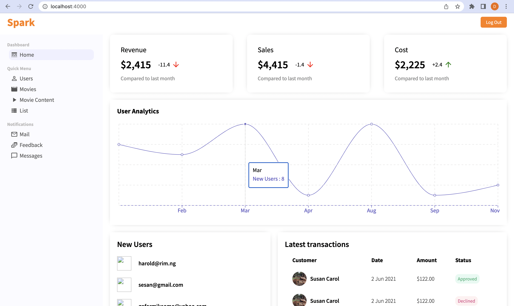
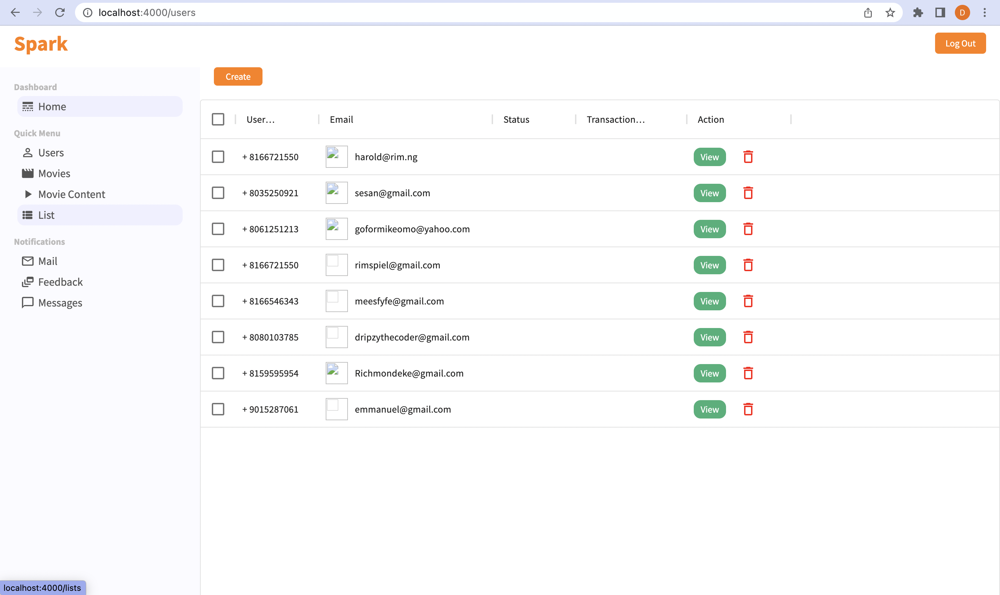
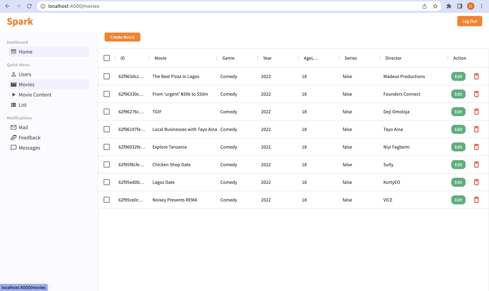
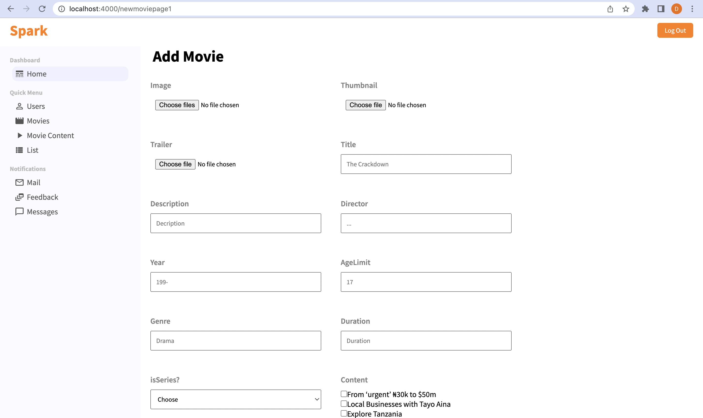
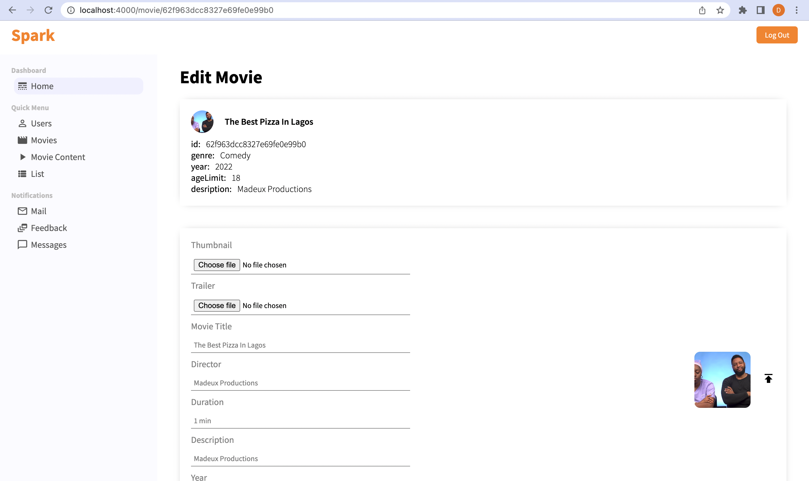
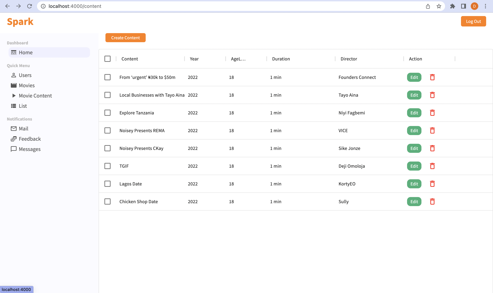
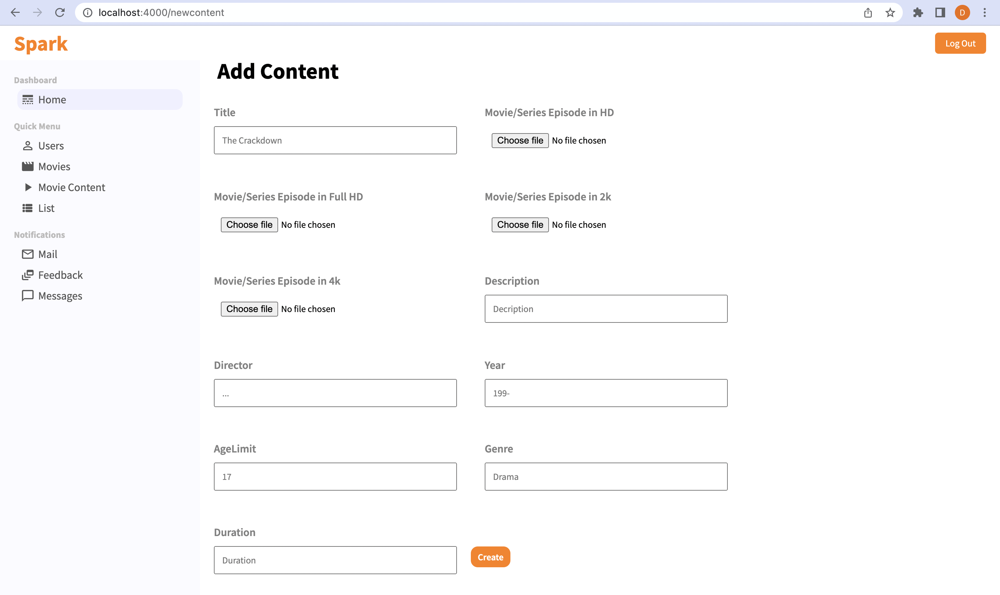
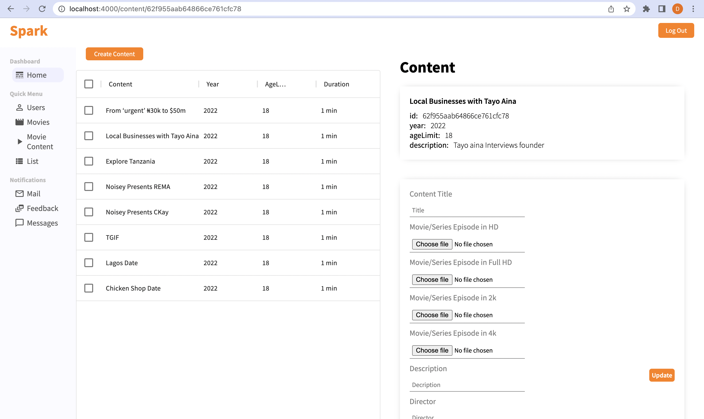
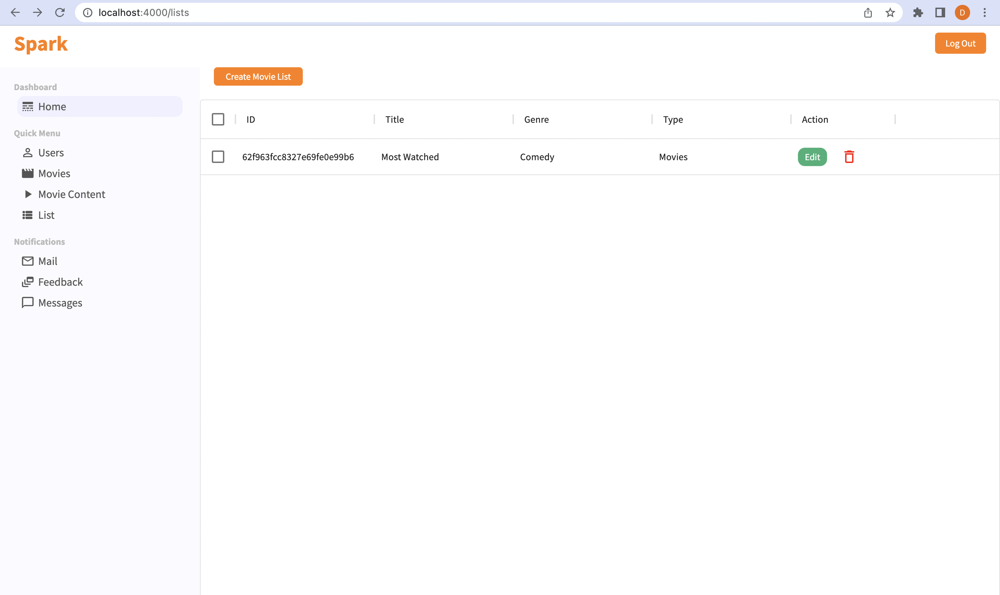
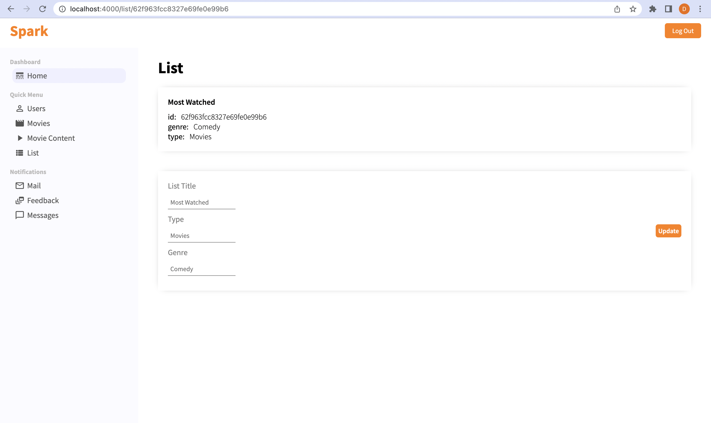

# Getting started with Spark By Talentroft

## Introduction
Spark is an online video platform where content creators and filmmakers can upload, display, and share their talents with others.
Our main goal is to create original content via a community of creators where collaboration is encouraged.

This Project is divided into three sub-projects.
-   Admin
-   Client
-   Server 

## Admin
The Admin sub-project is created for chosen Administrators with certain privileges to perform administrative tasks.

## Client
The Client sub-project is the platform where users can watch content.
[Spark-Client](https://github.com/Rileey/Spark-Client)

## Server
The Server sub-project is where the content, user and administrator data are being stored and manipulated. 
[Spark-Server](https://github.com/Rileey/Spark-Server)

You are in the Admin Repository.

This client project was bootstrapped with >> [Create React App](https://github.com/facebook/create-react-app).
You can learn more in the [Create React App documentation](https://facebook.github.io/create-react-app/docs/getting-started).

# Product Overview

## Objectives
This is the first version of the spark project. Currently still in progress.
The current version enables authenticated users on the platform to access to access spark's original movies and series content.
Once a user has been authenticated, the user can:
-   Sign Up
-   Log In
-   Browse Spark's Content
-   Edit Spark's Content
-   Watch Spark's Content 
-   Logout

# The source code.
The Spark Client was created using the React Library with the use of Context Api.
Learn more about react >> [React](https://reactjs.org).
Learn more about Context Api >> [Context](https://reactjs.org/docs/context.html).

# Pages

## Log In Page
This is where a registed user can resume their access to Sparks platform.

## Quick Menu
These pages are where spark displays its available content to the authenticated user. It shows movie, content and List that has been made available by spark and can be further manipulated by the Admin. 
## Home

## User

## Movie

## Content

## List

## Available Scripts

In the project directory, you can run:

### `npm start`

Runs the app in the development mode.\
Open [http://localhost:3000](http://localhost:3000) to view it in your browser.

The page will reload when you make changes.\
You may also see any lint errors in the console.

### `npm test`

Launches the test runner in the interactive watch mode.\
See the section about [running tests](https://facebook.github.io/create-react-app/docs/running-tests) for more information.

### `npm run build`

Builds the app for production to the `build` folder.\
It correctly bundles React in production mode and optimizes the build for the best performance.

The build is minified and the filenames include the hashes.\
Your app is ready to be deployed!

See the section about [deployment](https://facebook.github.io/create-react-app/docs/deployment) for more information.

### `npm run eject`

**Note: this is a one-way operation. Once you `eject`, you can't go back!**

If you aren't satisfied with the build tool and configuration choices, you can `eject` at any time. This command will remove the single build dependency from your project.

Instead, it will copy all the configuration files and the transitive dependencies (webpack, Babel, ESLint, etc) right into your project so you have full control over them. All of the commands except `eject` will still work, but they will point to the copied scripts so you can tweak them. At this point you're on your own.

You don't have to ever use `eject`. The curated feature set is suitable for small and middle deployments, and you shouldn't feel obligated to use this feature. However we understand that this tool wouldn't be useful if you couldn't customize it when you are ready for it.

Hope you find this very helpful.

To learn React, check out the [React documentation](https://reactjs.org/).